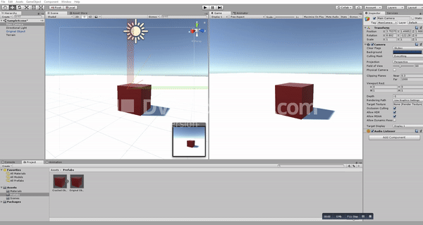
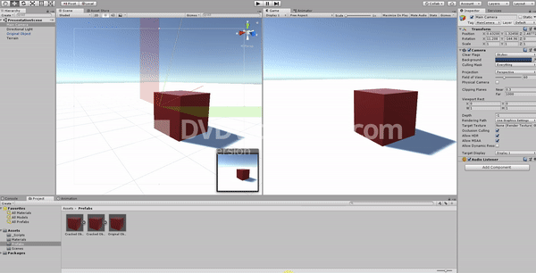

<h1>Destructable Objects in Unity</h1>

Hey, I made a simple system which allows 3d objects to be 'destructable'. All you need is a original object
and the destructed version (which consists of smaller objects).
<b>The objects doesn't need to have a pre-programmed physics</b>, because the simple system simulates some physics force (which you can change in 'AddForceToClone' scripts)

I'm looking forward to your responses - be sure to ask any questions or text me if you found any problems/bugs in it.

Enjoy!

============================================================================================================

============================================================================================================

============================================================================================================

<h2>INSTRUCTIONS</h2>

1) Make Your <b>original object</b> that you want to be destructible
2) Make the same object (<b>cracked version</b>), but it have to consist of smaller objects (for example: big cube which consists of 4 smaller cubes)
3) Place <b>original object</b> on scene
4) Add collider and rigidbody with mass 'X' to <b>original object</b>
5) Add 'DestroyObject' Script to <b>original object</b>
6) Make <b>original object</b> a prefab (just add it to Assets)
7) Place <b>cracked version</b> on scene
8) add rigidbody <b>only to the parts</b> (mass must be smaller than in original object)
9) add Mesh Collider <b>only to the parts</b> and select Convex in inspector
10) add 'AddForceToClones' script to <b>cracked version</b> of the object (the Parent of all the small parts)
11) make <b>cracked version</b> a prefab and delete it from the scene
12) in <b>original object</b> Inspector, add the cracked version Prefab to the script
Thats all.

Just remember to place <b>Cracked version</b> on the same .y position as the original object(if not, there could be some bugs)
